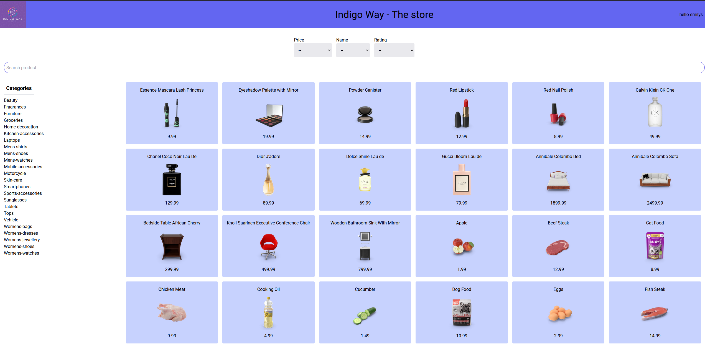

# React Store – E-Commerce React Application

A modern, **type-safe e-commerce front-end** built with **React, TypeScript**, and **Tailwind CSS**, designed with scalability, maintainability, and reusability in mind.

React Store allows users to browse products, view details, manage a shopping cart, and share product links—all while using secure JWT authentication and protected routes.

---



---

## 📦 Installation & Setup

Clone the repository and install dependencies:

```bash
git clone https://github.com/ritaCosta93/react-store.git
cd react-store
npm install
```

Start the development server:

```bash
npm start
```

Build for production:

```bash
npm run build
```

---

Store login:

```bash
username: emilys
password: emilyspass

```

---

## 🚀 Components & Pages

* **Categories** – `CategoriesList` displays product categories.
* **Products** – `ProductsList` displays products, `Product` renders individual items, `Pagination` manages page navigation, and `Sort` allows dynamic sorting.
* **Search** – Filters products based on user input.
* **Pages** – `AddProduct`, `Cart`, `Login`, `Product` handle full-page views and route logic.
* **Protected Routes** – Sensitive pages are protected via a `ProtectedRoute` interface, requiring authentication.
* **Partials** – Reusable UI elements used across components and pages.

---

## 🛠️ Tech Stack & Architecture

* **React** – Functional components with hooks for clean, declarative UI.
* **TypeScript** – Ensures type safety across props, state, and API models.
* **Tailwind CSS** – Utility-first styling for rapid, responsive UI development.
* **Axios** – Used exclusively for fetching product data from the backend.
* **Zustand** – Centralized state management with stores for cart, products, categories, and global state (`CartStore`, `ProductStore`, `CategoryStore`, `GlobalStore`).
* **JWT Authentication** – Secure login and session management.
* **Protected Routes** – Client-side route protection for sensitive pages.
* **URL Parameters** – Product pages use URL params to allow sharing direct links to specific products.

---

## ✅ Features

* Browse product catalog with **categories, pagination, and sorting**.
* **Shareable product links** via URL parameters for deep linking.
* **JWT-based authentication** with token storage.
* **Protected routes** ensure sensitive pages are only accessible to authenticated users.
* Add/remove products from the cart with **live updates** via Zustand stores.
* Fully **type-safe interfaces** for products, categories, cart, and users.
* **Modular architecture** separating components, pages, services, stores, and types.
* **Service layer** abstracts API requests from UI components for maintainability.
* Async handling of **API requests** with loading and error states.
* **Utility functions** (`formatText.ts`) for reusable logic.

---

## 📂 Folder Structure

```markdown
src/
├─ assets/
├─ css/
│  └─ index.css
├─ images/
│  └─ logo.webp
├─ components/
│  ├─ Categories/
│  │  └─ CategoriesList.tsx
│  ├─ Products/
│  │  ├─ Product.tsx
│  │  ├─ ProductsList.tsx
│  │  ├─ Pagination.tsx
│  │  └─ Sort.tsx
│  ├─ Search.tsx
│  └─ partials/
├─ interfaces/
│  ├─ api.ts
│  ├─ authenticationRequests.ts
│  ├─ cart.ts
│  ├─ categoriesRequests.ts
│  └─ productsRequests.ts
├─ pages/
│  ├─ AddProduct.tsx
│  ├─ Cart.tsx
│  ├─ Login.tsx
│  └─ Product.tsx
├─ routers/
│  ├─ constants.ts
│  └─ routes.tsx
├─ services/
│  ├─ authentication.ts
│  ├─ cart.ts
│  ├─ categories.ts
│  └─ products.ts
├─ store/
│  ├─ cart.tsx
│  ├─ category.tsx
│  ├─ global.tsx
│  └─ product.tsx
├─ types/
├─ stores/
│  ├─ CartStore.ts
│  ├─ CategoryStore.ts
│  ├─ GlobalStore.ts
│  └─ ProductStore.ts
├─ utils/
│  └─ formatText.ts
├─ App.tsx
├─ index.tsx
├─ App.test.tsx
├─ setupTests.ts
├─ reportWebVitals.ts
└─ other configs
```

---

## 📌 Architectural Decisions

* **Component-Based Architecture:** Modular and reusable components improve maintainability and testability.
* **Zustand State Management:** Centralized stores manage cart, products, categories, and global state efficiently.
* **Service Layer:** API requests are abstracted for decoupling, testability, and easy updates.
* **Shareable URLs:** URL parameters allow users to link directly to individual products.
* **JWT Authentication & Protected Routes:** Secure login, session management, and route-level access control.
* **TypeScript:** Type safety across the app reduces runtime errors and improves developer experience.
* **Tailwind CSS:** Ensures responsive and consistent UI with utility-first design.
* **Pagination & Sorting:** Efficient rendering and enhanced UX for large product catalogs.
* **Demo API:** Product data is fetched from https://dummyjson.com/